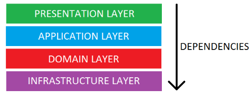
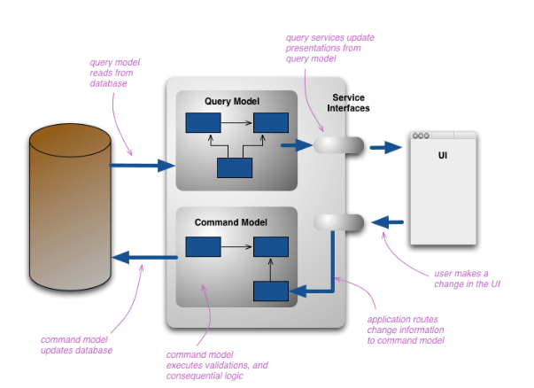
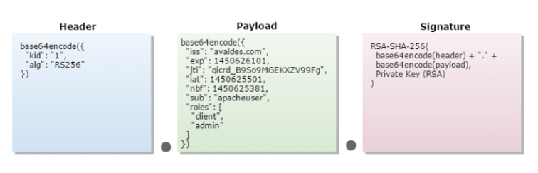

<!-- START doctoc generated TOC please keep comment here to allow auto update -->
<!-- DON'T EDIT THIS SECTION, INSTEAD RE-RUN doctoc TO UPDATE -->
**Table of Contents**  *generated with [DocToc](https://github.com/thlorenz/doctoc)*

- [Content](#content)
  - [I API Design](#i-api-design)
    - [Contract first](#contract-first)
    - [Contract last](#contract-last)
  - [ⅠⅠ Glory of Rest](#%E2%85%A0%E2%85%A0-glory-of-rest)
  - [Ⅲ Documentation](#%E2%85%A2-documentation)
  - [ⅠⅤ Versioning](#%E2%85%A0%E2%85%A4-versioning)
  - [Ⅴ Area Code](#%E2%85%A4-area-code)
  - [ⅤⅠ Clean Architecture](#%E2%85%A4%E2%85%A0-clean-architecture)
  - [ⅤII Database](#%E2%85%A4ii-database)
  - [ⅦⅠ CQRS (Command Query Responsibility Segregation)](#%E2%85%A6%E2%85%A0-cqrs-command-query-responsibility-segregation)
  - [Ⅸ Pagination](#%E2%85%A8-pagination)
  - [Ⅹ Security](#%E2%85%A9-security)

<!-- END doctoc generated TOC please keep comment here to allow auto update -->

# Content
[Go Back ... ](../backend/README.md)

[Font](https://dev.to/vaultree/designing-a-secure-api-4059?utm_source=tldrnewsletter)

## I API Design
<!-- -------------------------------- -->

An important point within an API is that it must establish pre-established behaviours through a Spec, contract or simply convention.

### Contract first

:green_circle: **Advantages** :green_circle: of this approach is that once the API is fully specified, **it is possible to parallelize the work**, for example, while the mobile and front-end team mock the services and the back-end team manages to implement the business.

:red_circle: **Disadvantages** :red_circle: the great effort to close the scope of the API makes several teams wait in the meantime. Moreover, as most teams rely on agile operations and **ever-changing software, closing the scope of the API can be a difficult** and time-consuming task.

### Contract last

The biggest advantage of this approach, of course, is the possibility of reusing existing classes and methods. However, **maintaining compatibility between the existing code and the service is one of the biggest challenges**.

## ⅠⅠ Glory of Rest
<!-- -------------------------------- -->

⏩ Level 0 — The Swamp of POX (Plain Old XML)

⏩ Level 1 — Individual Resources

This is what we call a URI based on multiple resources and an HTTP method/verb. It's when your range of URI's starts to increase and become more diverse, but your HTTP verb is still unique.

⏩ Level 2 — HTTP Verbs

We've reached a more complete maturity level, where we're starting to not only have individual resources like multiple URIs but also multiple HTTP. Here, we have reached a level of maturity that we call REST.

We have verbs for each action within CRUD (Create-Read-Update-Delete). In previous maturity models, the only verb used, even for querying, was POST.

⏩ Level 3 — Hypermedia Controls
Nothing.

## Ⅲ Documentation
<!-- -------------------------------- -->

Documentation is everything that the engineering team writes. It is, however, kind of ignored by other developers. And there are several reasons for this, for example, poorly documented or outdated information. The good news is that there are good tools that can help us on this documentation journey. [Swagger](https://swagger.io/), for example, greatly simplifies this process for us. There is also the [Open API](https://www.openapis.org/) whose objective is to create a specification for the APIs, bringing several advantages in addition to the documentation.

## ⅠⅤ Versioning
<!-- -------------------------------- -->

```bash
# Example
http://yourapi.domain.com/api/v1/doSomething
```

In this example, it is clear that the version is part of the API content and cannot be just numeric.

⏩ Query Parameters

NO REST:
```bash
# It's not cool
http://yourapi.domain.com/api/doSomething?version=1
```

⏩ Customising Request-Header

curl -H “Accepts-version: 1.0” http://yourapi.domain.com/api/doSomething

⏩ Versioning the Accept Header

Accept: application/vnd.example.v1+json
Accept: application/vnd.example+json;version=1.0

## Ⅴ Area Code
<!-- -------------------------------- -->
It is very difficult to talk about API and services without talking about DDD.

In addition to good naming practices, :warning: **it is extremely vital to separate the domains and subdomains of the application**. The concept of subdomain is quite interesting as it aims to divide the company's business for better understanding.

Once the concept of division has been mentioned, there is a problem in defining boundaries and services. It takes a good balance and knowledge on when and how to break boundaries. :warning:**There are several cases where breakage has brought advantages, however, there's an equal or greater number where APIs have returned to monoliths**.

## ⅤⅠ Clean Architecture
<!-- -------------------------------- -->


- `Presentation layer`: Encargados de enviar la respuesta al cliente (controllers).
- `Application layer`: contiene la lógica de negocio que no forma parte de las reglas de negocio, como un servicio.
- `Domain layer`. Representa el dominio de su aplicacion, consta de entidades, servicios… todas las reglas de negocio deben estar aquí!
- `Infraestrucutre layer` (capa de persistencia), contienen todas las clases que realizan alguna funcion estrictamente tecnica.
`
## ⅤII Database
<!-- -------------------------------- -->
No tracta tant del tipus de db ( escull la que s’adapti millor al problema que vols solucionar)

The points worth mentioning here is that they take into account the CAP theorem and also prevent database information or details from leaking to the API client.

## ⅦⅠ CQRS (Command Query Responsibility Segregation)
<!-- -------------------------------- -->
[Font](https://martinfowler.com/bliki/CQRS.html#:~:text=CQRS%20stands%20for%20Command%20Query,you%20use%20to%20read%20information.)



We come to CQRS or simply Command Query Responsibility Segregation. It is a pattern written by Greg Young in the year 2010 that separates data models a little and their responsibility for writing and reading.

## Ⅸ Pagination
<!-- -------------------------------- -->
Nothing


## Ⅹ Security
<!-- -------------------------------- -->

Basic Authentication: more basic

OAuth2.0: oke.


