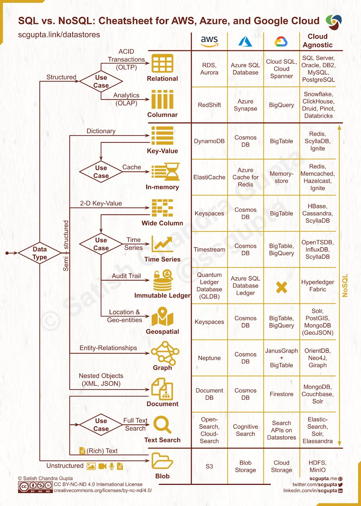

<!-- START doctoc generated TOC please keep comment here to allow auto update -->
<!-- DON'T EDIT THIS SECTION, INSTEAD RE-RUN doctoc TO UPDATE -->
**Table of Contents**  *generated with [DocToc](https://github.com/thlorenz/doctoc)*

- [Databases](#databases)
  - [:red_circle: Understanding Database Types](#red_circle-understanding-database-types)
    - [Relational Databases](#relational-databases)
    - [NoSQL](#nosql)
    - [NewSQL](#newsql)
    - [Time-series](#time-series)
  - [:red_circle: Factors to Consider in Database Selection](#red_circle-factors-to-consider-in-database-selection)
    - [Scalability](#scalability)
    - [Performance](#performance)
    - [Data Consistency](#data-consistency)
    - [Data Model](#data-model)
    - [Security](#security)
    - [Cost](#cost)
    - [Community and Ecosystem](#community-and-ecosystem)

<!-- END doctoc generated TOC please keep comment here to allow auto update -->

# Databases

## :red_circle: Understanding Database Types

`Relational / SQL Database:`

Examples:

- MySQL
- Oracle
- Microsoft SQL server
- PostgreSQL

Caracteristics:

- Relationship & referential integrity
- Structured data
- SQL suport
- Transactions & ACID properties
- Indexing & Optimization
- Security Features

`Time-series Database:`

Examples:

- InfluxDB
- Timescale DB
- Graphite
- Prometheus

Caracteristics:

- High-write & query performance
- Data Compression
- Time-based data retention policies
- Built-in time-series functions
- Scalability

`NoSQL Database:`

Examples:

- MongoDB
- Cassandra
- Redis
- Couchbase

Caracteristics:

- Document-based
- Column-based
- Key-value
- Graph-database
- Distributed Arch*
- Concurrency Ctrl*
- SQL Compatibility*

note (*): Advanced NoSQL -> newSQL 

### Relational Databases

Relational databases are based on the **relational model**, which organizes data into tables with rows and columns.

ACID: Atomicity, Consistency, Isolation, Durability

:green_circle: Key features and benefits of relational databases include:

- `Structured data organization`: Data in relational databases is stored in tables with a predefined schema, enforcing a consistent structure throughout the database. This organization makes it easier to manage and maintain data, especially when dealing with large amounts of structured data.

- `Relationships and referential integrity`: The relationships between tables in a relational database are defined by primary and foreign keys, ensuring referential integrity. This feature allows for efficient querying of related data and supports complex data relationships.

- `SQL support`: Relational databases use Structured Query Language (SQL) for querying, manipulating, and managing data. SQL is a powerful and widely adopted language that enables developers to perform complex queries and data manipulations.

- `Transactions and ACID properties`: Relational databases support transactions, which are sets of related operations that either succeed or fail as a whole. This feature ensures the ACID properties – Atomicity, Consistency, Isolation, and Durability – are maintained, guaranteeing data consistency and integrity.

- `Indexing and optimization`: Relational databases offer various indexing techniques and query optimization strategies, which help improve query performance and reduce resource consumption.

:red_circle: Relational databases also have some drawbacks:

- `Limited scalability`: Scaling relational databases horizontally (adding more nodes) can be challenging, especially when compared to some NoSQL databases that are designed for distributed environments.

- `Rigidity`: The predefined schema in relational databases can make it difficult to adapt to changing requirements, as **altering the schema may require significant modifications** to existing data and applications.

- `Performance issues with large datasets`: As the volume of data grows, relational databases may experience performance issues, particularly when dealing with complex queries and large-scale data manipulations.

- `Inefficient for unstructured or semi-structured data`: Relational databases are designed for structured data, which may not be suitable for managing unstructured or semi-structured data, such as **social media data or sensor data**.

### NoSQL

:warning: TODO: will continue

### NewSQL

### Time-series

## :red_circle: Factors to Consider in Database Selection

### Scalability

### Performance

### Data Consistency

### Data Model

### Security

### Cost

### Community and Ecosystem
