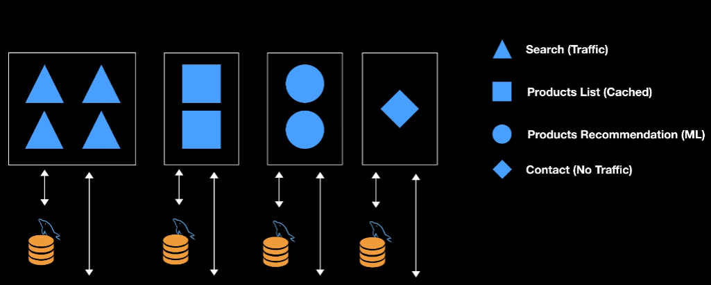
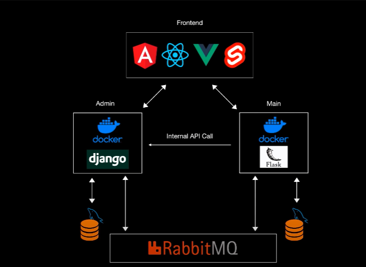

# Content

Source: [Python Microservices Web App (with React, Django, Flask) - Full Course](<https://www.youtube.com/watch?v=0iB5IPoTDts>)

<!-- START doctoc generated TOC please keep comment here to allow auto update -->
<!-- DON'T EDIT THIS SECTION, INSTEAD RE-RUN doctoc TO UPDATE -->
**Table of Contents**  *generated with [DocToc](https://github.com/thlorenz/doctoc)*

- [What are Microservices?](#what-are-microservices)
- [Project instruduction](#project-instruduction)

<!-- END doctoc generated TOC please keep comment here to allow auto update -->

## What are Microservices?

**What is a monolith?** All in the same places

Some parts of some project:

- Search (Traffic)
- Products List (Cached)
- Products Recommendation (ML)
- Contact (No Traffic)

:warning: Problems:

- Problem 1: we can scale this app, we can replicate all funcionalities
- Problem 2 : many languages and many teams (cause problems)
- ...

✅ We can have many instance for cover "traffic" and one instance for Contact (no traffic)

## Project instruduction

- <https://github.com/jonaas-dev/python-microservices>
- TODO: add frontend repo

Example:

